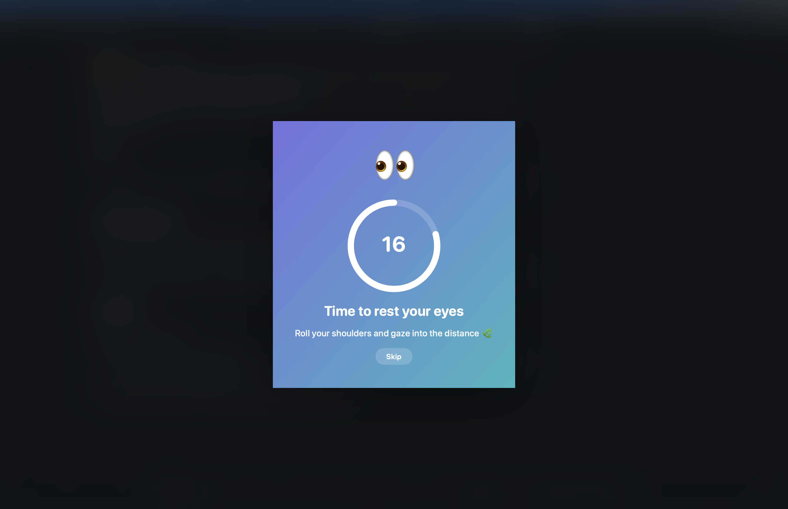
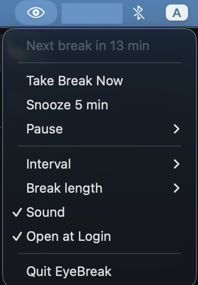

# EyeBreak 👀

A lightweight macOS menu-bar app that reminds you to rest your eyes on a schedule
(default every 30 minutes) with a cute full-screen break overlay. Prevents digital
eye strain using a gentle, hard-to-ignore nudge.

<p align="center">
  
</p>

## Download
Grab the latest signed `.dmg` from the **[Releases page](https://github.com/terry891/MacEye/releases/latest)** — open it, drag **EyeBreak** to **Applications**, done. (First launch: see the Gatekeeper note below.)

## Features
- Full-screen "cute" break overlay: blurred backdrop, gradient card, breathing 👀
  mascot, animated countdown ring, encouraging rotating messages.
- Menu-bar control (no dock icon): Take Break Now, Snooze 5 min, Pause (15 min / 1 hr),
  Interval (20/25/30/45/60 min), Break length (10/20/30/60 s), Sound, Open at Login, Quit.
- Configurable interval (default 30 min) and break length (default 20 s).
- Launches at login. Handles sleep/wake and multiple displays.

## Requirements
- macOS 13+ (built/tested on macOS 26)
- Builds a **universal binary** (Apple Silicon **arm64** + Intel **x86_64**)
- Xcode Command Line Tools (`xcode-select --install`) for building

## Build & Install
```bash
./build.sh --install     # compiles, signs, copies to /Applications, launches
```
Or build without installing:
```bash
./build.sh               # produces build/EyeBreak.app
./build.sh --run         # build and launch from build/
```

## Share with others (.dmg)
```bash
./package_dmg.sh         # produces build/EyeBreak-<version>.dmg
```
The DMG contains EyeBreak.app, an Applications drag-target, and an install note.

> **Gatekeeper note:** EyeBreak is **ad-hoc signed** (no paid Apple Developer ID /
> notarization), so on another Mac the first open is blocked. The recipient runs:
> ```bash
> xattr -dr com.apple.quarantine /Applications/EyeBreak.app
> ```
> …or uses **System Settings → Privacy & Security → Open Anyway**. (Proper
> distribution without this step requires an Apple Developer ID and notarization.)

## Releases (automated)
Pushing a version tag builds the universal `.dmg` and publishes a GitHub Release
automatically (via `.github/workflows/release.yml`, using the built-in token — no
secrets needed). To cut a new version:
```bash
git tag v1.1 && git push origin v1.1     # minor bump
git tag v2.0 && git push origin v2.0     # major bump
```
The workflow syncs the app's bundle version to the tag, runs tests, builds, packages,
and attaches `EyeBreak-<version>.dmg` to the release with a SHA-256 checksum.

## App icon
The icon is generated programmatically (no image assets) — a cute eye on the
indigo→teal theme. Regenerate it with:
```bash
swift tools/make_icon.swift build/AppIcon.iconset
iconutil -c icns build/AppIcon.iconset -o Resources/AppIcon.icns
```
`build.sh` bundles `Resources/AppIcon.icns` automatically.

## Usage
Click the 👁 icon in the menu bar to control everything. Change the interval and
break length there. "Open at Login" keeps it running in the background automatically.

<p align="center">
  
</p>

During a break, click **Skip** (or press **Esc**) to dismiss early; otherwise the
overlay fades away on its own when the countdown ends.

## Test
```bash
./test.sh                # runs pure scheduler-logic tests
```

## Tip: quick demo
Run with a short interval to see the overlay immediately (fires every 3 seconds):
```bash
EYEBREAK_DEBUG_SECONDS=3 ./build/EyeBreak.app/Contents/MacOS/EyeBreak
```

## Uninstall
Quit from the menu, then:
```bash
rm -rf /Applications/EyeBreak.app
```
To remove the login item, toggle "Open at Login" off before quitting.
